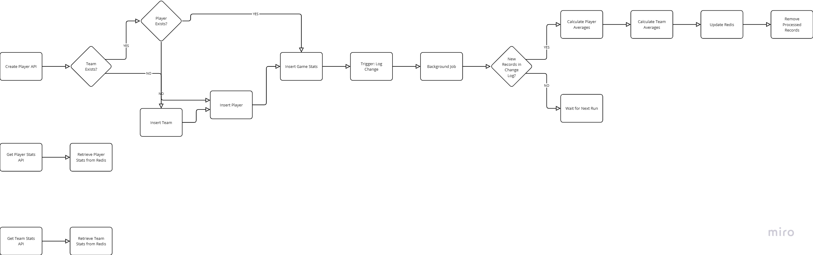

# NBA Stats 

This project is a system for managing and retrieving NBA player statistics efficiently using **Spring Boot**, **MySQL**, **Redis**, and **scheduled jobs**.

##  Features
- **Create Player API**: Inserts player data into MySQL, creates teams if they don’t exist, and logs player statistics.
- **Get Player Stats API**: Fetches average statistics per player and season from Redis.
- **Get Team Stats API**: Fetches average statistics per team and season from Redis.
- **Database Triggers**: Logs player and season changes in `change_log` when new game statistics are inserted.
- **Scheduled Job (Every 1 Minute)**: Processes new records in `change_log`, calculates averages, and updates stats in Redis.

---

##  System Architecture


---

##  How to Run the Project

### **1. Clone the Repository**
```sh
git clone https://github.com/tzipora-fried/nba-stats.git
```
### **2. Navigate into the project directory**
```sh
cd nba-stats
```
### **3. Build the project using Gradle:**
```sh
./gradlew build 
```

### **4. Start the application and required services using Docker Compose**
```sh
docker-compose up --build
```

---

## API Endpoints

### **1. Create Player**
**POST** `api/players/create`
#### Command for Linux/MacOS:
```sh
curl -X POST "http://localhost:8080/api/players/create" \
     -H "Content-Type: application/json" \
     -d '{
           "name": "Player One",
           "idNumber": "123456744",
           "teamName": "Team1",
           "gameStats": {
             "gameDate": "2025-03-07T20:00:00",
             "points": 10,
             "rebounds": 9,
             "assists": 5,
             "steals": 3,
             "blocks": 1,
             "fouls": 2,
             "turnovers": 4,
             "minutesPlayed": 2
           }
         }'
```

### **2. Get Player Stats**
**GET** `/api/stats/player/{idNumber}/season/{seasonYear}`
```sh
curl -X GET "http://localhost:8080/api/stats/player/123456744/season/2025" \
-H "Accept: application/json"
```

### **3. Get Team Stats**
**GET** `/api/stats/team/{teamId}/season/{seasonYear}`

```sh
curl -X GET "http://localhost:8080/api/stats/team/Team1/season/2025" \
-H "Accept: application/json"
```
---

## Database Schema
_


---

## Background Job & Triggers
- **Trigger on `game_stats` Insert**: Logs player ID and Season year in `change_log`.
- **Scheduled Job (Every Minute)**:
    1. Checks `change_log` for new records.
    2. Calculates **average player stats** and **average team stats**.
    3. Updates Redis with updated stats.

---

## Future Improvements

Initially, I planned to implement this system using **Debezium** for real-time change data capture (CDC) instead of using database triggers and scheduled jobs.  
However, due to time constraints, I opted for a more straightforward approach with MySQL triggers and scheduled tasks.

A future iteration of this project could replace the **change_log** table and scheduled jobs with **Debezium** to stream database changes directly to **Kafka**, ensuring real-time updates to Redis with improved scalability and reliability.


